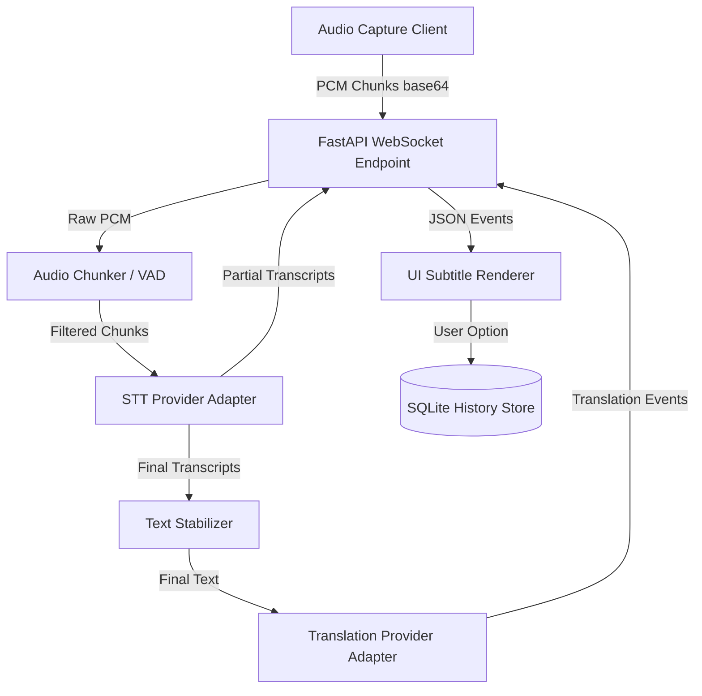

# LiveSub AI - Architecture Document

This document describes the high-level architecture, protocols, and latency specifications for **LiveSub AI**, a real-time system audio translation platform.

---

## 1. Architectural Overview



### Flow Breakdown:
1. **Client Audio Capture**: The Electron desktop application captures system audio, window audio, or browser tab audio.
2. **Resampling & Chunking**: Audio is resampled (usually to 16kHz or 24kHz, 16-bit, mono PCM) and packaged into 100~500ms chunks.
3. **WebSocket Stream**: Chunks are encoded to base64 and streamed to the FastAPI backend via a WebSocket connection.
4. **VAD (Voice Activity Detection)**: The backend filters out silent chunks before passing audio to the transcription model (planned for future phases).
5. **STT Processing**: The STT Adapter streams chunks to the selected provider (e.g., Deepgram, OpenAI Realtime, Local Whisper) and yields partial/final transcriptions.
6. **Translation Engine**: Final transcriptions are routed to the Translation Adapter (e.g., Gemini, GPT-4o) using context windowing (recently transcribed sentences) and custom glossaries.
7. **Rendering & Persistence**: Transcripts and translations are pushed back to the client via WebSockets to be rendered in the main dashboard or transparent overlay, and saved to the history database.

---

## 2. WebSocket Protocol (`/ws/audio`)

### Client -> Server

#### Audio Chunk Event (`audio.chunk`)
Sent periodically (every 100~300ms) with raw PCM audio data encoded as base64.
```json
{
  "type": "audio.chunk",
  "session_id": "uuid",
  "format": "pcm_s16le",
  "sample_rate": 16000,
  "channels": 1,
  "timestamp_ms": 123456,
  "audio_base64": "..."
}
```

#### Audio Stop Event (`audio.stop`)
Sent by the client when capture is stopped to trigger finalization.
```json
{
  "type": "audio.stop",
  "session_id": "uuid"
}
```

### Server -> Client

#### Partial Transcript Event (`transcript.partial`)
High-frequency updates containing active speech guesses. Stabilized on the frontend by showing them as translucent or italic.
```json
{
  "type": "transcript.partial",
  "session_id": "uuid",
  "source_language": "en",
  "text": "I think we should",
  "stability": 0.72,
  "timestamp_ms": 123900
}
```

#### Final Transcript Event (`transcript.final`)
Fires when the STT model detects a sentence boundary. Triggers the translation process.
```json
{
  "type": "transcript.final",
  "session_id": "uuid",
  "source_language": "en",
  "text": "I think we should deploy the model tomorrow.",
  "start_ms": 123000,
  "end_ms": 126000
}
```

#### Final Translation Event (`translation.final`)
Contains translation text for a finalized sentence.
```json
{
  "type": "translation.final",
  "session_id": "uuid",
  "source_language": "en",
  "target_language": "ko",
  "source_text": "I think we should deploy the model tomorrow.",
  "translated_text": "내 생각에는 내일 모델을 배포하는 게 좋겠습니다.",
  "confidence": 0.91
}
```

---

## 3. Provider Adapter Design

To support hot-swapping models and fallback strategies, the platform uses abstract base classes for all model providers.

```python
class STTProvider(ABC):
    @abstractmethod
    async def stream_transcribe(self, audio_stream: AsyncGenerator[bytes, None]) -> AsyncGenerator[dict, None]:
        pass

class TranslationProvider(ABC):
    @abstractmethod
    async def translate(self, text: str, source_lang: str, target_lang: str, context: list[str] = None) -> str:
        pass
```

All concrete implementations (e.g. `DeepgramSTTProvider`, `GeminiTranslationProvider`, `LocalWhisperProvider`) inherit from these and are managed via a centralized registry.

---

## 4. Latency Budget Analysis

To deliver a premium, fluid captioning experience, our target end-to-end latencies are defined as:

| Phase | Path | Target Latency | Notes |
| :--- | :--- | :--- | :--- |
| **Audio Capture** | Soundcard loopback -> Send to WS | **< 150ms** | Client-side chunk size dependent |
| **Partial STT** | WS chunk read -> Client partial update | **300ms ~ 1.2s** | Dependent on model server response |
| **Final STT** | Sentence boundary -> Client final update | **1.0s ~ 3.0s** | Sentence silence detection timeout |
| **Translation** | Final text -> Client translation update | **1.5s ~ 4.0s** | Final STT latency + translation api call |
